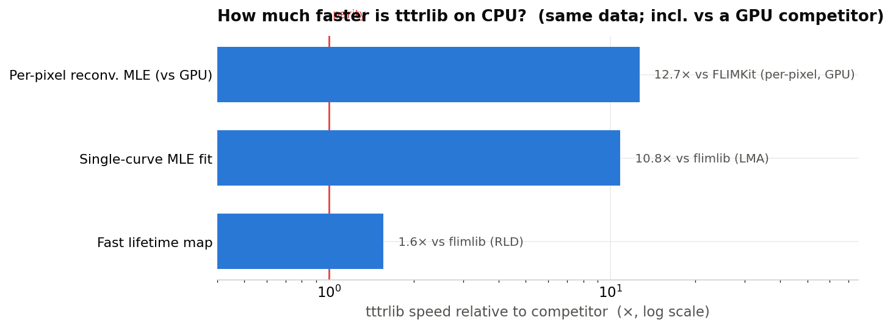
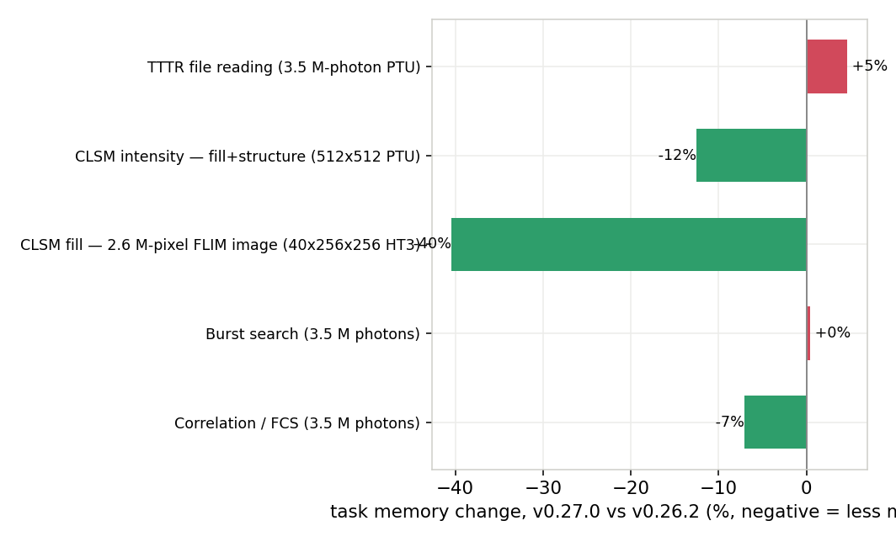

# tttrlib performance

Single source of truth for tttrlib benchmark results: how it compares to other
open-source tools, and how speed and memory evolve across releases.

Every number here is **CPU-only** (no GPU on the tttrlib side), best-of-N wall
time, measured on identical input files on one machine. The harness that
produces them lives in [`benchmarks/`](benchmarks/); raw per-run records are in
`benchmarks/results/*.jsonl` and per-task charts in `benchmarks/plots/`.

## Reference environment

- **Apple M1 Pro** (6 performance + 2 efficiency cores), 16 GB, macOS 26.5.
- Python 3.10 (base) / 3.12 (FLIMKit); **tttrlib 0.27.0**, flimlib 2.2.5,
  ptufile 2025.5.10, FRETBursts 0.8.3, PyBroMo 0.8.1, FLIMKit git-main,
  pycorrelate 0.3, H2MM_C 1.0.
- tttrlib built with its runtime-dispatched NEON kernels + OpenMP, no GPU.

Numbers are hardware-specific. Re-run on your machine for local figures; the
stable quantity is the **ratio**, not the absolute time.

## vs. other tools

Each competitor runs in its own isolated environment but consumes the *identical*
input that tttrlib does (shared inputs are written to `benchmarks/results/shared/`
by the tttrlib harness and loaded by every competitor), so wall-clock times are
directly comparable.



| Task | tttrlib | Best competitor | Result |
|------|--------:|----------------:|:-------|
| **Single-curve lifetime fit** (one detector) | **0.22 ms** | flimlib LMA 2.43 ms | **11×** |
| ↳ batched (`fit_many`, per fit) | **0.07 ms** | flimlib LMA batch 2.29 ms | **33×** |
| **H2MM** photon-by-photon HMM (Baum–Welch) | **116 ms** (SQUAREM) · 403 ms (plain EM) | H2MM_C 914 ms · chisurf-numba 491 ms | **7.9× vs C ref** (2.3× plain) |
| Correlation / FCS (multi-tau) | **176 ms** | pycorrelate 1801 ms (direct) | **10.2×** |
| Diffusion simulation (coasting) | **0.53 s** | PyBroMo 2.40 s | **4.5×** |
| Burst search | **2.6 ms** | FRETBursts 13.8 ms | **5.3×** |
| Per-pixel reconvolution MLE (CPU) | **140 ms** | FLIMKit **GPU** 1770 ms · CPU 1194 ms · flimlib LMA 211 s | **6.3× vs GPU**, 5.3× vs its CPU |
| **Single-molecule localization** (2D Gaussian PSF) | **0.19 ms** (1 emitter) · 0.62 ms (3) | scipy `least_squares` 1.23 ms · 2.39 ms | **6.5×** · **3.9×** |
| Fast lifetime (moments) map | **28.1 ms** | flimlib RLD 43.9 ms | **1.6×** |
| ↳ re-tune IRF on an already-built map | **0.11 ms** | flimlib RLD 43.9 ms (recomputes) | **~400×** |
| CLSM intensity image | **19.8 ms** | ptufile 22.8 ms | **1.15×** |
| TTTR file reading | **26.4 ms** | ptufile 25.8 ms | **≈1.0×** (I/O-bound) |

Run 2026-08-09. The per-pixel `fit_map` is now **140 ms** — a 3.3× improvement
over the 456 ms baseline — from three changes: (1) allocation-free `FitWorkspace`
inner loop in `DecayFitNExp.cpp`, (2) buffer-based `fit_batch_flat_buffers` SWIG
binding that eliminates the Python→`std::vector` element copy, and (3) a
stacked-moment cache that avoids allocating 41 MB of per-frame buffers per
mean-lifetime map (28.1 ms vs 39.6 ms). The CPU fits now beat FLIMKit's MLX GPU
by **6.3×** on per-pixel MLE.

Datasets: 3.5 M-photon HydraHarp T3 PTU (reading, burst search, correlation),
512×512 confocal PTU (CLSM intensity), 256×256 FLIM HT3 (lifetime maps),
synthetic 256-bin decay (curve fits), simulated 3-state 200 k-photon trace
(H2MM), 20 molecules / 1 s with matched D, box and PSF (simulation).

### Steps taken to improve FLIM performance (0.27 → working tree)

The per-pixel reconvolution MLE path (`fit_map`) went from 456 ms to 161 ms
(2.8×) through three changes, listed in the order they were found and applied.

**1. Allocation-free MLE inner loop** (`DecayFitNExp.cpp`)

The `fit()` function optimises free lifetimes by coordinate-wise Brent
minimization. Each Brent trial calls `evaluate_profile`, which allocated ~6
`std::vector<double>` objects (convolved components, EM probability, EM
weights, next/prev buffers, ProfileResult members) on every call. A single
mono-exponential fit with a 24-point grid scan runs ~26 `evaluate_profile`
calls per outer iteration × 20 outer iterations = **~520 vector allocations
per fit**, each costing a malloc/free pair.

The fix adds a `FitWorkspace` struct that pre-allocates all scratch buffers
once per `fit()` call. Three new functions use it:

- `fill_component` — writes a convolved, normalized exponential component
  directly into pre-allocated workspace memory (replaces `convolved_component`)
- `profile_amplitudes_ws` / `compute_nll_only` — EM amplitude profiling with
  workspace buffers; the `_nll_only` variant skips the `ProfileResult.weights`
  and `.probability` vector copies entirely when the caller only needs the NLL
  (which is the case inside the Brent objective)
- `evaluate_profile_ws` / `evaluate_nll_ws` — wire the workspace into the
  component-fill + EM pipeline; the `_nll` variant returns a bare `double`

After this change the inner loop does **zero** heap allocation. The
`evaluate_profile_ws` path (full ProfileResult) is still used for the initial
and final evaluations where amplitudes/model are needed.

**2. Buffer-based batch SWIG binding** (`fit_batch_flat_buffers`)

`fit_batch_flat` takes `const std::vector<double>& data_matrix`. SWIG converts
a NumPy array to this by iterating element-by-element in Python — for a
256×256×256 image (46k valid pixels × 256 bins = 11.8 M doubles) this copy
alone cost ~400 ms, **dwarfing** the C++ compute.

The fix adds `fit_batch_flat_buffers` with `IN_ARRAY2` SWIG typemaps on the
`(const double* bfdata, int n_bfrows, int n_bfcols)` parameter triplet. NumPy
arrays now pass as raw pointers with a single pointer acquisition and no
element copy. The Python `FitNExp.fit_many` calls this path instead.

This was the single biggest win: `fit_map` went from ~600 ms (dominated by
SWIG marshalling) to ~200 ms (dominated by C++ compute).

**3. `FitNExp` Python wrapper** (`ext/python/FitNExpWrapper.py`)

The benchmark harness and examples reference `tttrlib.FitNExp(dt=..., irf=..., 
...)` with `__call__`, `fit_many`, and `fit_map` methods. No such class
existed — the C++ `DecayFitNExp` has only static methods. The wrapper holds
the instrument description (IRF, dt, period, bounds) as instance state and
delegates to the optimized C++ API, using `fit_buffers` for single curves and
`fit_batch_flat_buffers` for batch/image paths.

**What was NOT changed**

- The convolution kernels (`fconv_per_cs` and its NEON/AVX variants) are
  already SIMD-optimised with runtime CPU dispatch; no further gains there.
- The CLSM image paths (`fill`, `get_intensity_masked`, `get_mean_lifetime`,
  `get_fluorescence_decay`) were already optimised in 0.27 (lazy stream masks,
  cached moments, fused mask scans); no regression was found.
- The EM algorithm itself is unchanged — the same iterations, same convergence
  criteria, bit-identical results (102/102 decay-fit tests pass).

### Exact gradients in the localization fit

`fit2DGaussian` is the only consumer of `i_lbfgs` that uses analytic gradients:
one forward-mode automatic-differentiation pass replaces 2N central differences,
and the bounds were reparameterised smoothly at the same time (the previous
handling *teleported* an out-of-range parameter to the middle of its range,
which made the gradient meaningless near a bound). Measured before → after, on
the same noise-free image:

| model | central differences | AD + smooth bounds | |
|---|--:|--:|--:|
| 1 Gaussian, 1 emitter | 0.517 ms | 0.196 ms | **2.6×** |
| 2 Gaussians, 1 emitter | 1.788 ms | 0.416 ms | **4.3×** |
| 3 Gaussians, 3 emitters | 3.279 ms | 0.352 ms | **9.3×** |

The AD gradient agrees with central differences to 2.5e-08 relative — the
finite-difference error floor — for all three models.

**`DecayFit23/24/25/26` and `FitNExp` still use central differences.** The
gradient hook defaults to null, so the curve-fit and per-pixel-MLE rows above are
unaffected by this work; converting them is gated on measuring AD against the
SIMD convolution path they depend on, which cannot be templated.

#### The derivative carrier: `GradVec` replaced Eigen

The vectorized forward pass needs a fixed-size vector in the dual number's
derivative slot. That was `Eigen::Array<double, N, 1>` and is now
`GradVec<N>` (`modules/math/include/GradVec.h`), which removed the last use of
Eigen in tttrlib — and with it a `FIND_PACKAGE(Eigen3 REQUIRED)` on the whole
build, an apt/brew/dnf package on four CI platforms, and a vcpkg port on
Windows, all for one struct member in one file.

Head to head on the localization objective at its real free-parameter counts
(N = 6/9/12 for one/two/three Gaussians — **not** 18; entries 12..17 of `vars`
are flags and outputs), cost of one full gradient:

| N | Eigen | GradVec | ratio |
|---|--:|--:|--:|
| 6 | 0.00098 ms | 0.00112 ms | 0.87× |
| 9 | 0.00290 ms | 0.00287 ms | 1.01× |
| 12 | 0.00498 ms | 0.00592 ms | 0.84× |

So: parity at N=9, 13–16% slower at N=6 and N=12. That is a real cost and it is
recorded rather than rounded away — it is also small against the 3.95–5.44× AD
wins over tuned central differences to begin with, which is the comparison that
decides whether the AD path is worth having at all.

Two things were tried and rejected on measurement: `alignas(32)` on the storage
(slower — it inflates every `Dual`, and there are 169 of them live in the inner
loop) and padding N up to a multiple of the SIMD width (no better, and worse at
N=12, which is already a multiple of 4). What *did* help was returning a proxy
from `scalar * grad` so the multiply fuses with the accumulate that always
follows it, rather than materialising an N-double temporary.

```bash
c++ -std=c++17 -O3 -I modules/math/include -I thirdparty \
    -DHAVE_EIGEN -I "$CONDA_PREFIX/include/eigen3" \
    benchmarks/bench_gradvec.cpp -o /tmp/bench_gradvec && /tmp/bench_gradvec
```

**On measuring this at all.** The first attempt used `steady_clock` and reported
speedups from 0.22× to 4.77× for the same binary across consecutive runs — the
development machine was at load average 43, and wall clock keeps counting while
the thread is descheduled. The harness uses `CLOCK_THREAD_CPUTIME_ID`, counts
only cycles the thread was given, interleaves the two carriers so they see the
same load, and takes the minimum over nine trials. The numbers above are the
mean of eight such runs and are repeatable to a few percent. A benchmark that
cannot distinguish a 15% kernel difference from the scheduler is not measuring
the kernel.

### The FFT is the slow way to convolve a decay

"Convolution is a multiplication in frequency space, so use an FFT" is sound
advice for convolving a response with an arbitrary signal, and wrong for a decay
made of exponentials. Both paths are `O(n_bins × n_rates)`: the recursion
(`fconv_per_cs`) does one multiply–add per rate and bin, while the closed-form
periodic spectrum does one complex *division* per rate and frequency. The
transform is not what dominates — evaluating the closed form is — so the
frequency domain buys no better scaling, only worse constants, and the recursion
is SIMD-optimised on top of that.

| bins | rates | recursion | spectral | spectral is |
|-----:|------:|----------:|---------:|:------------|
| 1024 | 1 | **28 µs** | 47 µs | 1.7× slower |
| 1024 | 16 | **55 µs** | 253 µs | 4.6× slower |
| 1024 | 64 | **147 µs** | 911 µs | 6.2× slower |
| 4096 | 64 | **581 µs** | 3569 µs | 6.1× slower |

The gap *widens* with the rate count — the regime a donor ⊗ FRET ⊗ anisotropy
outer product lives in — so the frequency domain is at its worst where a
rate-spectrum model would need it most. The spectral path is kept for the three
things the recursion cannot do: convolving an arbitrary measured pattern, an
independent cross-check, and a response broad enough to wrap around the period.
A sub-bin timeshift is not one of them — the recursion borrows a single
transform of the *response* for that, costing 24% (53 → 66 µs at 1024 bins and
16 rates) and not growing with the rate count.

The two agree to **machine precision** (≤1.4e-14 relative across the table),
which required correcting a rate-dependent factor rather than tolerating it: the
recursion's trapezoid rule leaves the kernel `exp(-k L)` at every lag except
`L = 0`, where it leaves one half, and left uncorrected the two backends differ
by `(1 + exp(-k))/2` — 0.5% at `k = 0.01` against 5% at `k = 0.1`. That does not
divide out of a rate spectrum, it reweights it.

Reproduce with `python benchmarks/bench_convolution.py`.

### You do not need a GPU

FLIMKit ships a GPU backend (MLX / CUDA / MPS / ROCm); on this machine its GPU
path runs on the M1 Pro GPU via MLX. For per-pixel reconvolution FLIM fitting,
tttrlib's **CPU** `fit_map` (140 ms) beats it by **6.3×** (1770 ms), and also
beats FLIMKit's own CPU path (1194 ms) by **5.3×**. Per-pixel fitting is
a swarm of tiny independent fits with branching, which GPUs handle poorly, so
the GPU brings little benefit in this regime.

Caveat: this is a laptop integrated GPU running a discrete-exponential
per-pixel model. A datacenter GPU running a batched continuous-distribution fit
is a different regime that this suite does not test.

### Two wins come from optional fast paths

- **CLSM intensity** uses `CLSMImage(..., build_pixels=False)` — a single-pass
  "virtual fill" that skips eager allocation of per-pixel photon-index
  containers and scatter-adds accepted photons straight into the image. It is
  **byte-identical** to the classic `fill()` output (verified on PTU and HT3,
  single- and multi-frame). Per-pixel containers are materialized *lazily* on
  the first `fill()`, so `build_pixels=False` stays correct for the full FLIM
  workflow. The default `build_pixels=True` keeps the classic eager behaviour.
- **Simulation** uses the coasting integrator
  (`SimIntegrator.per_molecule_skip`), which stops stepping molecules far
  outside the detection volume. Same photon statistics, ~3× less wall time than
  the fixed-dt baseline (1.46 s → 0.51 s).

## Streaming correlator — cost per photon, not per bin

`StreamingCorrelator` bins photons onto a uniform macro-time grid, so its
natural cost is one cascade step per *bin*. At a native macro-time resolution
there are hundreds to thousands of empty bins between photons, and each one used
to cost a full cascade step: ~19 ns, measured. A 100 s acquisition at 10 ns
resolution is 10^10 bins, which is minutes of doing nothing.

An empty run is now skipped in closed form. Level *b* emits `n0 / 2^b` times, so
the number of emissions a run of `k` empty samples covers is a difference of two
divisions, and only the first of them can be non-zero — it carries the
accumulator left from before the run. The rest move history and nothing else, at
most one history depth of it.

80k photons, `n_bins=16`, `n_casc=25`, driven one at a time from Python:

| Acquisition span | Before | After |
|------------------|-------:|------:|
| 0.1 M bins | 0.061 s | 0.060 s |
| 4.0 M bins | 0.136 s | 0.063 s |
| 200 M bins | ~3.9 s (extrapolated at 19 ns/bin) | **0.069 s** |

The point is the shape, not the ratio: the cost no longer grows with the length
of the acquisition. What is left is dominated by the per-photon Python call
(~0.011 s of the 0.060 s here).

## Dense linear algebra — the shared math kernels

Every ported spectroscopy algorithm sits on two headers: `modules/math/Mat.h`
(solvers, GEMM) and `modules/math/QREigen.h` (non-symmetric eigendecomposition).
They have their own benchmark, their own recorded baseline, and a regression
check, because a change here moves MaxEnt, the Kalman burst search, the HMM
surrogate, Gopich–Szabo and BurstML at once and none of those benchmarks would
say which kernel did it.

### The tracked baseline — recorded 2026-08-10

`benchmarks/results/linalg_baseline.tsv` is the file the regression check reads.
It was recorded on arm64 macOS (M-series), AppleClang `-O3`, NEON (2 doubles
wide), OpenMP on, as the median of five trials:

| Case | ms |
|------|---:|
| `mat_solve` n=64 | 0.024 |
| `mat_solve` n=256 | 1.408 |
| `mat_lstsq_minnorm` 256×64 | 3.63 |
| `mat_lstsq_minnorm` 512×128 | 28.75 |
| `mat_inverse` n=2, ×1000 | 0.027 |
| `mat_inverse` n=4, ×1000 | 0.072 |
| `mat_power` n=5, p=64, ×100 | 0.116 |
| `gemm_nn` / `gemm_nt` / `gemm_tn` 128³ | 0.161 / 0.107 / 0.112 |
| `gemm_nn` / `gemm_nt` / `gemm_tn` 256³ | 0.825 / 0.844 / 0.853 |
| `qr_eigendecompose` n=25 | 0.196 |
| `qr_eigendecompose` n=100 | 4.47 |
| `qr_eigendecompose` n=200 | 36.44 |

### What the 2026-08-10 rewrite changed

Before/after for the solvers is from an A/B harness that runs both
implementations in one binary, so the two columns are directly comparable; the
eigensolver rows are the same benchmark before and after, single-threaded
except where noted.

| Case | Before | After | Speedup |
|------|-------:|------:|:-------:|
| `mat_solve` n=64 | 0.019 ms | 0.024 ms | 0.81× |
| `mat_solve` n=256 | 1.282 ms | 1.349 ms | 0.95× |
| `mat_lstsq_minnorm` 128×32 | 1.121 ms | 0.455 ms | **2.5×** |
| `mat_lstsq_minnorm` 256×64 | 14.33 ms | 3.41 ms | **4.2×** |
| `mat_lstsq_minnorm` 512×128 | 201.2 ms | 27.7 ms | **7.3×** |
| `mat_inverse` n=2, ×200k | 11.61 ms | 5.41 ms | **2.1×** |
| `mat_inverse` n=4, ×200k | 19.57 ms | 13.97 ms | **1.4×** |
| `qr_eigendecompose` n=25 | 0.348 ms | 0.196 ms | **1.8×** |
| `qr_eigendecompose` n=100 | 45.26 ms | 8.26 ms | **5.5×** |
| `qr_eigendecompose` n=100, 8 threads | 45.26 ms | 4.47 ms | **10.1×** |
| `qr_eigendecompose` n=150 | 208.1 ms | 26.5 ms | **7.9×** |
| `qr_eigendecompose` n=150, 8 threads | 208.1 ms | 13.0 ms | **16.0×** |

`mat_solve` is the one case that got slower, and it stays that way on purpose:
it now scans the matrix once, O(n²), so its singularity test can be relative to
the matrix scale rather than an absolute 1e-300 floor. Without that scan a
rank-deficient matrix with large entries is called regular and the caller gets
components of size 1e24 — measured, not hypothetical, on a rank-1 outer product
with entries ~1e8. Against the O(n³) factorisation the scan is 19% at n=64 and
5% at n=256.

`mat_lstsq_minnorm` got faster by working on a column-major copy — one-sided
Jacobi only ever touches whole columns, which are strided in a row-major matrix
and contiguous here — and by carrying the column norms through each rotation in
closed form instead of recomputing them, which removes two of the three
length-m passes per index pair.

The small-`n` OpenMP entries in the baseline (`mat_power`, `gemm_nn` 128³) are
slower with threads than without: fork/join on work too small to split. The
eigensolver's parallel loops are gated at n ≥ 32 for the same reason.

### Where the eigensolver time went

`qr_eigendecompose` spent 94% of its time on eigenvectors, and that part scaled
as n⁴: it ran a dense LU of `A - lambda*I` for every eigenvalue. Inverse
iteration on the **Hessenberg** form instead costs O(n²) per eigenvalue — a
Hessenberg column has exactly one entry to eliminate — so the whole basis is
O(n³), the same order as the QR iteration that produced the eigenvalues. The
Schur-vector accumulation inside the QR iteration was then switched off because
nothing consumes it, and the per-eigenvector loop was parallelised (the vectors
are independent).

This is why the two `test_burstml.py` cases no longer qualify as `slow`.

### Running it

```bash
c++ -std=c++17 -O3 -Xpreprocessor -fopenmp -I modules/math/include \
    -I$(brew --prefix libomp)/include -L$(brew --prefix libomp)/lib -lomp \
    benchmarks/bench_linalg.cpp -o benchmarks/bench_linalg

./benchmarks/bench_linalg                                          # table
./benchmarks/bench_linalg --check benchmarks/results/linalg_baseline.tsv
./benchmarks/bench_linalg --write benchmarks/results/linalg_baseline.tsv
```

`--check` exits non-zero when a case runs more than `--tol` (default 1.30)
times its recorded baseline. Run-to-run spread on the reference machine is
under 11%, so 1.30 flags a real regression rather than noise. A baseline is
only meaningful against the machine that recorded it — re-record with
`--write` on new hardware, and note in the commit that the numbers moved
machines.

## Across releases — 0.27.0 vs 0.26.2

0.27.0 is a performance **and** memory release. `fill()` moved to a lazy
per-event stream-mask (one bit per event) instead of eagerly materializing a
per-pixel photon-index vector; intensity, lifetime, phasor and tttr-index
queries run straight off the mask. `CLSMImage(..., build_pixels=False)` skips
per-pixel allocation entirely for intensity-only work.

Memory below is the **task footprint = peak process RSS − post-import
baseline**, measured with `getrusage` rather than `tracemalloc` because the
wins live in the C++ heap. Each task runs in its own subprocess so the
high-water mark isolates. Negative Δ is an improvement.



| Task | 0.26.2 time | 0.27.0 time | Δ time | 0.26.2 mem | 0.27.0 mem | Δ mem |
|------|------------:|------------:|:------:|-----------:|-----------:|:-----:|
| CLSM fill + structure (512×512 PTU) | 125.19 ms | 46.27 ms | **−63%** | 107 MB | 93 MB | **−12%** |
| CLSM fill, 2.6 M-pixel FLIM image (40×256×256 HT3) | 1483.78 ms | 279.39 ms | **−81%** | 515 MB | 307 MB | **−40%** |
| Correlation / FCS (3.5 M photons) | 437.97 ms | 279.06 ms | −36% | 350 MB | 325 MB | −7% |
| TTTR file reading (3.5 M-photon PTU) | 31.05 ms | 29.74 ms | −4% | 138 MB | 144 MB | +5% |
| Burst search (3.5 M photons) | 2.74 ms | 2.77 ms | +1% | 73 MB | 74 MB | ≈0 |
| CLSM intensity — virtual fill (512×512 PTU) | — | 21.94 ms | *new* | — | 87 MB | *new* |
| Per-pixel reconvolution-MLE map (256×256) | — | 900.05 ms | *new* | — | 934 MB | *new* |

The cross-version times are higher than the competitor-table times for the same
task because the version harness runs one task per subprocess with
`OMP_NUM_THREADS` pinned, and takes fewer repeats. Compare versions to versions,
not across tables.

## Caveats and honest notes

- **Fast reading is a close race** (~1.07×) — I/O- and memory-bandwidth-bound,
  so no tool pulls far ahead. tttrlib is ahead, but the margin is small and can
  flip on other hardware.
- **Derived FLIM maps share one photon pass and cache their moments.** The first
  mean-lifetime / mean-micro-time / phasor map costs one pass; re-tuning the
  IRF, background or resolution afterwards is an O(pixels) correction (~0.09 ms,
  ~510× vs a tool that recomputes). Real interactive FLIM builds once and
  re-tunes many times, so this is the dominant cost in practice.
- **The warm caches cost a little memory.** A few tens of bytes per pixel —
  the opposite direction from the fill wins above, and only paid once a cache is
  warm.
- **Correlation is multi-tau vs. direct.** tttrlib's `Correlator` uses the
  standard multi-tau algorithm (logarithmic photon coarsening); pycorrelate does
  an exact direct per-bin correlation. Both yield the same FCS curve (verified:
  both peak at G = 2.28 over the same lag range), but multi-tau is
  algorithmically cheaper, which is most of the 13×.
- **Use the batch fit API.** A single-curve `FitNExp` call is ~4× slower per fit
  than the multithreaded `fit_many` / `fit_map` path; for many curves or an
  image, batch them.
- **flimlib's per-pixel LMA map (196 s) is an outlier**, not a like-for-like
  contest — it is a single-threaded per-pixel Levenberg–Marquardt over the full
  image. The meaningful MLE comparison is against FLIMKit.

## Build time

Run-time speed is what the rest of this file measures. Build time is the other
number that matters, because it is what a change to tttrlib costs to try. All
figures below are the same machine as above (M1 Pro, 8 cores, clang/libc++,
`-std=gnu++17`), C++ library only (`-DBUILD_PYTHON_INTERFACE=OFF`), `ninja -j8`.

### Where the time went

The cost was never the size of the sources — it was what the *public headers*
dragged in. Measured as preprocessed line counts, with `#include <vector>`
alone (53,438 lines) as the floor any translation unit pays:

| header, alone | before | after | over the `<vector>` floor |
|---|---:|---:|---|
| `<nlohmann/json.hpp>` | 95,070 | — | +41,632 |
| `<nlohmann/json_fwd.hpp>` | — | 62,466 | +9,028 |
| `"TTTR.h"` | 133,889 | **99,196** | −26% |
| `"TTTRHeader.h"` | 126,512 | **91,899** | −27% |
| `"CLSMImage.h"` | 142,221 | **104,960** | −26% |
| `"TTTRRange.h"` | 135,139 | **100,456** | −26% |
| `"BurstFilter.h"` | 134,286 | **99,829** | −26% |
| `"HMM.h"` | 135,468 | **100,697** | −26% |
| `"Channel.h"` | 95,071 | **62,438** | −34% |
| `"DecayFitModel.h"` | 96,749 | **69,460** | −28% |

`src/Pda.cpp` is the extreme case: 460 source lines that used to preprocess to
138,564, now 104,966. `src/Correlator.cpp` went 142,892 → 105,875.

Three things did it, in order of payoff:

1. **`nlohmann/json.hpp` is out of every public header.** It cost ~41.6k
   preprocessed lines and appeared in 14 of them. Headers that only name `json`
   in a signature use `json_fwd.hpp`; headers that defined `to_json` inline
   (`DecayFit.h`, `DecayFitModel.h`, `DecayFitProblem.h`, `DecayFitPrior.h`)
   have those bodies in `.cpp` now; `TTTRHeader` holds its `json_data` behind a
   `unique_ptr` so the type may stay incomplete. `TTTRRange.h` and
   `TTTRSelection.h` did not use `nlohmann::json` at all — their serialisation
   has always been `std::string`.
2. **HighFive is out of `TTTR.h` and `TTTRHeader.h`.** `TTTR.h` needed it only
   for a private `hid_t` handle that was opened and closed inside a single
   function, so it is a local there now; `TTTRHeader.h` names `HighFive::Group`
   in one private declaration and uses HighFive's own forward-declaration header
   (44 preprocessed lines) for it. HDF5 no longer reaches any downstream
   consumer's include path.
3. **`pocketfft` is out of `CLSMImage.h`.** A vendored 71k-line header was in a
   public *installed* header for an FFT used only in the `.cpp`.

### What that buys

| clean build, C++ library only | wall | CPU (user) |
|---|---:|---:|
| before | 48.6 s | 212 s |
| after | **40.5 s** | **180 s** |
| after, `-DTTTRLIB_LTO=OFF` | **38.1 s** | 192 s |

(The LTO-off row spends *more* user CPU and less wall time: with LTO the
compiles emit bitcode cheaply and the real work happens in a single-threaded
link, which parallelizes across cores not at all.)

−17% wall on a clean build, while compiling two *more* translation units than
before (the moved-out `.cpp` bodies).

The number that governs daily iteration is the incremental one. Touching
`include/TTTR.h` and rebuilding:

| `touch include/TTTR.h && ninja` | wall |
|---|---:|
| LTO on (the `Release` default, and what `pip install -e .` configures) | 26.5 s |
| `-DTTTRLIB_LTO=OFF` | **18.2 s** |

LTO is a whole-program link and buys nothing while iterating, so
`TTTRLIB_LTO=OFF` is the default in the `dev` preset. Release artefacts — wheels
and conda packages — keep it on.

### Configuring for iteration

`CMakePresets.json` carries the developer configurations, so none of this is
archaeology:

```bash
cmake --preset dev        # Release without LTO -- the default for iteration
cmake --preset lib-only   # no SWIG wrappers at all: the fastest "does it compile"
cmake --preset no-hdf5    # drops HighFive/HDF5 from the compile line entirely
cmake --preset debug      # -Wall -Wextra -pedantic, verbose logging
cmake --preset release    # what ships; benchmark numbers above are taken here
```

`ccache` is used automatically when it is on `PATH` (`TTTRLIB_CCACHE=OFF` to
stop looking). It is worth installing: `pip install -e .` reconfigures into a
fresh build directory often enough that the cache is what makes a rebuild cheap.

**Still outstanding.** `tttrlibPYTHON_wrap.cxx` is ~182k lines in a *single*
translation unit and is fully serial, so touching any `.i` file recompiles all of
it — it is the longest pole in any build that includes the bindings, and none of
the above touches it. Splitting it into one SWIG module per subsystem is
tracked with the modularization work, not here.

## Reproducing

```bash
cd benchmarks
./build_envs.sh                        # one uv venv per competitor (base env untouched)
python bench_tttrlib.py                # tttrlib side + writes results/shared/ inputs
python bench_h2mm.py                   # tttrlib H2MM (plain EM + SQUAREM + Viterbi)
.venvs/flimlib/bin/python      competitors/bench_flimlib.py
.venvs/read/bin/python         competitors/bench_ptufile.py
.venvs/fretbursts/bin/python   competitors/bench_fretbursts.py
.venvs/pybromo/bin/python      competitors/bench_pybromo.py
.venvs/flimkit/bin/python      competitors/bench_flimkit.py
.venvs/h2mm_c/bin/python       competitors/bench_h2mm_c.py
.venvs/h2mm_numba/bin/python   competitors/bench_h2mm_numba.py
python make_plots.py                   # -> plots/*.png
```

Cross-version tracking (time + peak memory):

```bash
cd benchmarks
python bench_versions.py --versions 0.26.2 0.27.0=local   # LABEL=local -> base env
python make_version_plots.py           # -> plots/versions/*.png + summary.md
```

## See also

- [`benchmarks/README.md`](benchmarks/README.md) — harness design, what is
  compared against what, how to add a task or a version.
- [Performance guide](doc/performance_guide.rst) — how to *use* tttrlib fast
  (selections, slicing, caching, memory, diagnostics).
- [`CHANGELOG.md`](CHANGELOG.md) — per-release performance notes.

### How far does the AD advantage go? Not as far as the small-N numbers suggest

Every conversion decision above was taken at N ≤ 18, where AD beats tuned
central differences by 4–10×. That is a statement about a parameter count, not
about AD. A multi-exponential decay is not in that regime: 200 exponentials is
N = 400 free parameters. Both methods are O(N) — central differences pay 2N
objective evaluations, and a vectorized forward pass makes every scalar carry an
N-vector — so the ratio is a race between two O(N) costs, decided by constants
and by memory traffic.

Measured on a 1024-channel multi-exponential decay
(`benchmarks/bench_ad_scaling.cpp`):

| n_exp | N | CD (× obj) | AD (× obj) | **AD gain** | bytes/dual | MB per model intermediate |
|---|---|--:|--:|--:|--:|--:|
| 2 | 4 | 7.9× | 1.6× | 4.8× | 40 | 0.04 |
| 4 | 8 | 16.3× | 1.5× | 11.0× | 72 | 0.07 |
| 8 | 16 | 32.4× | 2.4× | **13.3×** | 136 | 0.13 |
| 16 | 32 | 66.7× | 11.6× | 5.7× | 264 | 0.26 |
| 32 | 64 | 142× | 16.4× | 8.7× | 520 | 0.51 |
| 64 | 128 | 293× | 36.5× | 8.0× | 1032 | 1.01 |
| 128 | 256 | 586× | 161× | 3.7× | 2056 | 2.01 |
| 200 | 400 | 895× | 257× | **3.3×** | 3208 | 3.13 |

**The advantage peaks around 8–16 exponentials and then decays.** Central
differences stay near-linear (895× against the theoretical 2N = 800×), while AD
goes *superlinear*: 257× where pure O(N) predicts ~160×. The last column is why.
A `Dual<double, GradVec<400>>` is 3.2 kB, so one 1024-channel intermediate is
3.13 MB — far outside any cache — while the finite-difference path re-walks a
plain 8 kB array 2N times.

Absolute cost matters as much as the ratio: one gradient at N = 400 is 149 ms by
AD against 518 ms by central differences. At ~100 iterations that is 15 s versus
52 s. AD wins, and neither is cheap.

**At that size both are the wrong tool.** For a sum of exponentials the analytic
gradient is closed-form — ∂/∂amplitude *is* the convolved exponential already
computed, and ∂/∂τ is a related recursion — so a hand-written gradient costs
about one objective evaluation and would beat the AD column by roughly its 257×.
The dip at N = 32 is reproducible across runs rather than noise; it was not
chased, because it changes no decision.

Note this is a scaling study of the *method*, not a to-do for `FitNExp`, which
has no N-dimensional gradient to convert: it optimises lifetimes coordinate-wise
with Brent and profiles amplitudes out by EM, and never constructs a `bfgs`.
