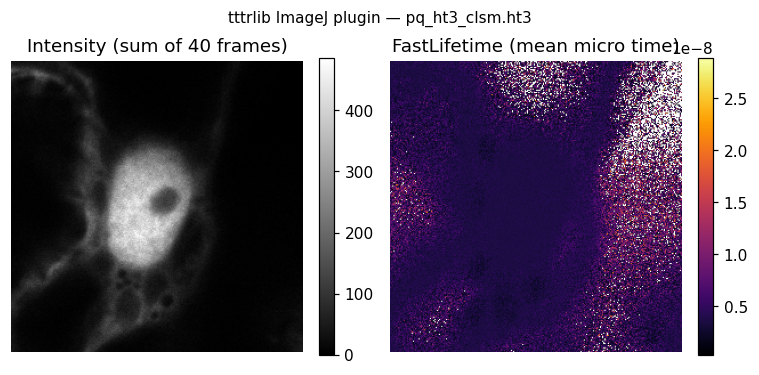

.. _imagej_plugin:

tttrlib for Java & the ImageJ/Fiji plugin
=========================================

The Java binding is a self-contained JNI JAR that exposes the tttrlib C++ engine
to any JVM language, and doubles as a **Fiji plugin** for opening and
reconstructing confocal (CLSM) FLIM data.

.. note::

   **Maturity.** The Java binding and plugin share the tested C++ core with
   Python, but the Java layer is newer and less tested than the Python package.
   Please `report issues <https://github.com/fluorescence-tools/tttrlib/issues>`__.

.. important::

   **Fiji is required.** The plugin's commands are SciJava ``Command`` plugins,
   discovered through annotations. A plain ImageJ 1.x install has no SciJava
   layer, so the commands never appear in its menu — they do not error, they are
   simply invisible. Use `Fiji <https://fiji.sc>`__ (or ImageJ2).

   The Java *library* has no such requirement: it works on any JVM.

Install
-------

Download ``tttrlib_imagej-<version>.jar`` from the
`GitHub releases <https://github.com/Fluorescence-Tools/tttrlib/releases>`__ page.
It bundles the native library for **Linux, macOS (Intel + Apple Silicon), and
Windows**, so no compilation or ``java.library.path`` setup is required.

- **As a Fiji plugin:** drop the JAR into ``Fiji.app/plugins`` and restart, or
  drag it onto the Fiji main window. The commands appear under
  **Plugins ▸ tttrlib**.
- **As a library:** put the JAR on your class path. A small ``NativeLoader``
  extracts and loads the correct native at run time.

.. note::

   On macOS, ``Fiji.app`` is a normal folder — open it directly rather than using
   *Show Package Contents*.

Fiji update site
~~~~~~~~~~~~~~~~

Releases are published to a self-hosted update site, so Fiji can install and then
keep the plugin up to date on its own:

*Help ▸ Update… ▸ Manage update sites ▸ Add unlisted site*, then

``https://fluorescence-tools.github.io/tttrlib/imagej/``

The site is generated by **Fiji's own updater**, not by hand: ``db.xml.gz``
carries a per-file checksum in a Fiji-specific format, and a hand-written one
produces a site the updater reports as corrupt. To reproduce or repair it
locally:

.. code-block:: bash

   # the JAR must sit inside the Fiji install that runs the updater
   cp tttrlib_imagej-<version>.jar Fiji.app/plugins/tttrlib_imagej.jar
   cd Fiji.app
   ./ImageJ-linux64 --update add-update-site tttrlib \
       "https://fluorescence-tools.github.io/tttrlib/imagej/" \
       "file:" "/absolute/path/to/site/"
   ./ImageJ-linux64 --update upload --update-site tttrlib plugins/tttrlib_imagej.jar

``file:`` selects the local uploader. The upload directory **must be absolute** —
a relative path is resolved against ``Fiji.app`` and silently writes the site
into the install instead. The updater fills in the checksum, timestamp,
description, author and the plugin's jar dependencies by itself.

The release JAR remains attached to each GitHub release for manual installation.

Commands
--------

The plugin reads time-tagged time-resolved confocal files — PicoQuant PTU/HT3,
Becker & Hickl SPC, Leica SP5/SP8 — with the tttrlib C++ engine via JNI.

.. list-table::
   :header-rows: 1
   :widths: 40 60

   * - Menu
     - What it does
   * - *File ▸ Open* (and drag-and-drop)
     - Opens ``.ptu`` / ``.ht3`` / ``.spc`` directly as an intensity image with
       default settings.
   * - **Plugins ▸ tttrlib ▸ Open TTTR CLSM Image**
     - Full reconstruction: channel groups, PIE windows, intensity, FastLifetime,
       phasor, N&B, decay.
   * - **Plugins ▸ tttrlib ▸ Show TTTR Metadata**
     - Header tags and derived acquisition parameters as a table.
   * - **Plugins ▸ tttrlib ▸ Batch Process Folder…**
     - Reconstructs every TTTR file in a folder and writes TIFFs. Headless-capable.
   * - **Plugins ▸ tttrlib ▸ FLIM ▸ Decay from Mask**
     - Micro-time decay of the current ROI, one column per routing channel.
   * - **Plugins ▸ tttrlib ▸ FLIM ▸ Lifetime Map**
     - Per-pixel IRF-corrected mean lifetime (the first moment of the decay), as
       opposed to the reader's *FastLifetime*, which is the mean arrival time.
   * - **Plugins ▸ tttrlib ▸ FLIM ▸ Fit Decay per Pixel…**
     - Multi-exponential fit per pixel, giving lifetime, amplitude and
       photon-count maps.
   * - **Plugins ▸ tttrlib ▸ FLIM ▸ Phasor Plot**
     - 2-D histogram of the per-pixel phasor coordinates, plus the universal
       semicircle as a table for overlay.
   * - **Plugins ▸ tttrlib ▸ Correlation ▸ Pixel-wise FCS**
     - A correlation curve for every pixel, computed from the photon stream
       rather than from binned intensities. The lag occupies its own axis, so a
       profile through the stack is that pixel's curve.
   * - **Plugins ▸ tttrlib ▸ Correlation ▸ Image Correlation (ICS)**
     - Spatial autocorrelation per frame, with optional average subtraction.
   * - **Plugins ▸ tttrlib ▸ Detector Definition…**
     - View and edit detectors and PIE windows, in chisurf's setup format.
   * - **Plugins ▸ tttrlib ▸ Settings…**
     - Plugin-wide defaults, remembered between sessions and exportable as JSON.

Detectors and PIE windows (chisurf-compatible)
----------------------------------------------

Naming routing channels — *green* / *red*, prompt / delayed, parallel /
perpendicular — is what makes the raw channel numbers usable. The plugin reads
and writes **chisurf's detector-setup JSON**, so a setup defined in chisurf's
*Setup:Channel Definition* tool works here unchanged, and vice versa.

A setup holds named **PIE windows** and named **detectors**:

.. code-block:: json

   {
     "setups": {
       "confocal": {
         "windows":  { "prompt": [0, 2000], "delayed": [2000, 4095] },
         "detectors": {
           "green": { "chs": [0, 1], "micro_time_ranges": [[0, 4095]],
                      "g_factor": 1.0, "l1": 0.0, "l2": 0.0 },
           "red":   { "chs": [4, 5], "micro_time_ranges": [[0, 4095]] }
         },
         "polarization_resolved": true
       }
     },
     "last_used": "confocal"
   }

Point *Open TTTR CLSM Image* at such a file and it reconstructs one image channel
per **window × detector** pair — ``prompt_green``, ``delayed_red`` and so on —
each gated by the intersection of the window and that detector's own
``micro_time_ranges``. This is deliberately **not** the cross product of the
*Channel groups* and *Micro-time ranges* fields: two detectors in the same window
can be gated differently, which those fields cannot express.

.. important::

   Window bounds and ``micro_time_ranges`` are **raw micro-time channels** of the
   TTTR file — not nanoseconds, and not divided by any binning. This matches
   chisurf. Multiply by ``tttr_reading.micro_time_resolution`` for nanoseconds.

**Polarization.** The setup-level ``polarization_resolved`` flag (default
``true``, editable in *Detector Definition…*) decides whether there is a VV/VH
split at all:

* **resolved** — a detector's ``chs`` list is read as interleaved
  parallel/perpendicular: **even positions in the list** are parallel, odd are
  perpendicular. Explicit ``ch_p`` / ``ch_s`` lists override the interleaving.
* **not resolved** — the channels are a single unpolarised stream; there is no
  perpendicular set, and a leftover ``ch_p``/``ch_s`` does not resurrect one.

Tick *Split parallel / perpendicular* to get separate ``…_p`` and ``…_s`` image
channels. ``g_factor``, ``l1`` and ``l2`` are carried through for downstream
anisotropy work.

.. note::

   The channel list alternates VV, VH, VV, … so the split is by **position**,
   never by whether the channel number is even. For ``chs = [8, 0, 3]`` that is
   parallel ``[8, 3]`` and perpendicular ``[0]``.

   chisurf's MLE setup parser used to split on channel-number parity instead,
   which agrees only when the channels run consecutively from an even start;
   that has been corrected (``chisurf/core/fluorescence/mle/setup.py``) so both
   sides now use the alternating rule.

A detector whose gate does not overlap the window is dropped rather than being
left ungated — an empty micro-time range would otherwise be read as "no gate" and
silently admit every photon.

Keys the plugin does not model — ``mle_settings``, ``fret_calibration``,
``channel_luts`` — are preserved when a setup is saved, so a round trip through
Fiji does not damage a chisurf file. The derived ``channels`` cross-product cache
is regenerated on save.

.. note::

   chisurf's GUI migrates ``~/.chisurf/detector_setups.json`` into its database
   and then deletes it, so write to a side file and load that in chisurf rather
   than editing the canonical path in place.

Settings
--------

Every dialog field is remembered per user automatically — SciJava persists
``@Parameter`` values through Fiji's preference store. *Plugins ▸ tttrlib ▸
Settings…* adds what that cannot do: defaults shared **across** commands (above
all the detector setup file, and which detectors and windows to use from it), and
export/import of a whole configuration as JSON for another machine or for version
control.

When the reader's setup field is left blank it falls back to the remembered
setup, together with the remembered detector and window selection.

All commands are SciJava ``Command``\ s, so they are macro-recordable, scriptable
from Groovy/Jython, and run under ``--headless``.

Output images
~~~~~~~~~~~~~

Images are ImageJ2 ``Dataset``\ s with **named axes**:

``X``, ``Y``, ``CHANNEL`` (one per routing-channel group), ``TIME`` (frames), and
— when micro-time ranges are given — a custom ``PIE`` axis. Group and window are
therefore independently addressable rather than flattened into a single channel
index.

Photon counts use 32-bit (``UnsignedIntType``) counters end to end, so pixels
above 65535 photons are neither truncated nor wrapped.

Channel groups
~~~~~~~~~~~~~~

The **Channel groups** field groups routing channels into colour channels with
the syntax ``groupA;groupB;...``, each group a comma-separated channel list. For
example ``1,3;2,4`` makes colour channel 1 from routing channels {1, 3} and
colour channel 2 from {2, 4}.

PIE / micro-time ranges
~~~~~~~~~~~~~~~~~~~~~~~

The **Micro-time ranges** field gates photons by arrival time with the syntax
``start,stop;start,stop;...`` — e.g. ``0,111;200,499;900,1200``. Each window
becomes a position on the ``PIE`` axis. Combine with channel groups for
PIE/ALEX-style donor/acceptor prompt-and-delayed splitting.

Other options
~~~~~~~~~~~~~

* **Stack frames** collapses the frame dimension to a single frame.
* **Auto-correct IRF offset** estimates the instrument-response offset from the
  rise of the aggregate decay and applies it to FastLifetime (subtracting the
  offset) and Phasor (rotating each pixel phasor), so no separate IRF file is
  needed.
* **Number & Brightness (N&B)** computes per-pixel ``B = variance/mean``,
  ``N = mean²/variance`` and ``epsilon = B − 1`` across frames (≥ 2 frames
  required; unaffected by *Stack frames*).

Photon budget in the FLIM commands
~~~~~~~~~~~~~~~~~~~~~~~~~~~~~~~~~~

A single confocal FLIM pixel usually holds only tens of photons — far too few
for a stable multi-exponential fit. *Fit Decay per Pixel* therefore defaults to
stacking frames, coarsening the micro-time axis and binning 4×4 pixels; relax
those only when the data supports it.

With no IRF file the fit uses a delta response, i.e. it does **not** deconvolve,
so recovered lifetimes carry the width of the real instrument response. Supply an
IRF measurement when the absolute lifetime matters; for comparing pixels within
one image the uncorrected values are usually enough.

Using the Java API
------------------

Array-returning C++ getters that use output pointers are exposed as
``…_into(array)`` accessors: preallocate a primitive array and pass it in. Each
returns the *true* element count, so a return value larger than the array length
means the result was truncated.

.. code-block:: java

   import io.github.fluorescencetools.tttrlib.*;

   TTTR data = new TTTR("photon_stream.ptu");
   long n = data.size();

   long[] macro = new long[(int) n];
   data.get_macro_times_into(macro);        // fills the array, returns the count

   // Reconstruct a CLSM/FLIM image for routing channel 0
   VectorInt32 ch = new VectorInt32(); ch.add(0);
   CLSMImage img = new CLSMImage(data, new CLSMSettings(), null, true, ch);
   int nPix = img.getN_frames() * img.getN_lines() * img.getN_pixel();
   int[] intensity = new int[nPix];
   img.get_intensity_into(intensity);

Unlike R, Java carries 64-bit macro times as a native ``long`` (no precision
loss) and supports directors (subclassing ``PdaCallback``).

The reconstruction logic is also available without any ImageJ dependency, in
``io.github.fluorescencetools.tttrlib.imagej.core`` (``ClsmReconstructor``,
``DecayExtractor``) — useful for scripting and testing.

Build from source
-----------------

Two steps: CMake produces the SWIG proxies and the JNI native, Maven builds the
plugin JAR.

.. code-block:: bash

   # 1. SWIG Java proxies + JNI native
   cmake -S . -B build-java -G Ninja \
     -DBUILD_PYTHON_INTERFACE=OFF -DBUILD_JAVA_INTERFACE=ON \
     -DBUILD_LIBRARY=OFF -DBUILD_PHOTON_HDF=OFF -DCMAKE_BUILD_TYPE=Release
   cmake --build build-java --target tttrlibJava

   # 2. Stage the generated artefacts into the Maven source roots (gitignored)
   DST=ext/java/imagej/src/main/java/io/github/fluorescencetools/tttrlib
   cp build-java/java-pkg/src/main/java/io/github/fluorescencetools/tttrlib/*.java $DST/
   cp ext/java/pkg/src/main/java/io/github/fluorescencetools/tttrlib/NativeLoader.java $DST/
   mkdir -p ext/java/imagej/src/main/resources/native/darwin-aarch64
   cp build-java/java-pkg/native/libtttrlibjni.* \
      ext/java/imagej/src/main/resources/native/darwin-aarch64/libtttrlibjni.dylib

   # 3. Plugin JAR (name the native per System.mapLibraryName for your platform:
   #    libtttrlibjni.so / libtttrlibjni.dylib / tttrlibjni.dll)
   cd ext/java/imagej && mvn package

CI builds the native on Linux, macOS (x86-64 and arm64) and Windows, then
assembles a single cross-platform JAR containing all four.

Testing
-------

The Java binding is verified against the same cross-language reference values as
Python and R (``test/java/``), and the plugin has headless JUnit tests under
``ext/java/imagej/src/test/java/`` that run the commands through
``CommandService`` and assert dataset dimensions, axis types and pixel values.

.. code-block:: bash

   TTTRLIB_DATA=/path/to/tttr-data mvn -f ext/java/imagej test

See :doc:`languages` for a side-by-side comparison of the three languages.

Source: `ext/java/imagej/ <https://github.com/Fluorescence-Tools/tttrlib/tree/main/ext/java/imagej>`__.
