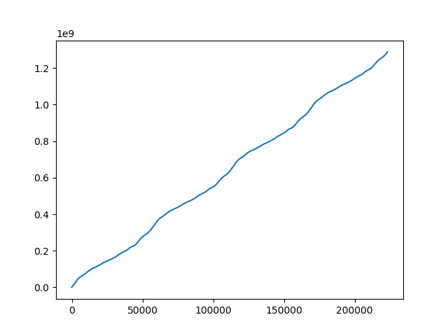
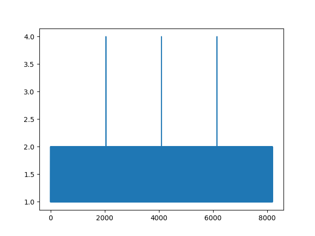
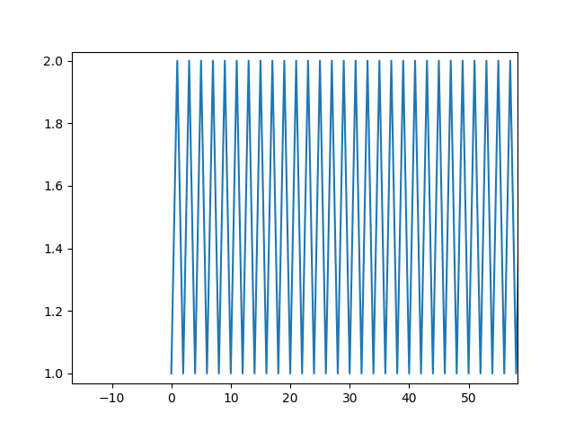
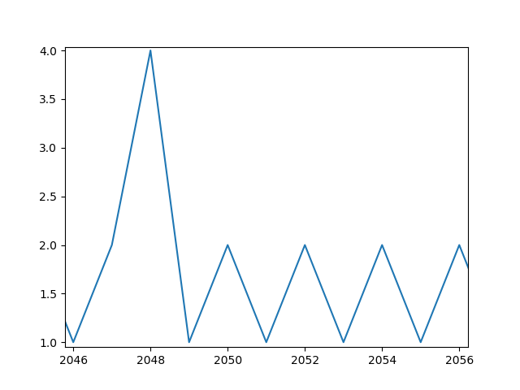
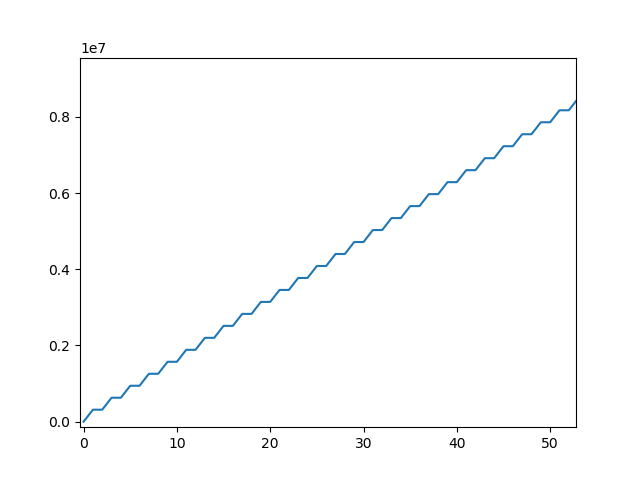

Imaging
=======

Confocal laser scanning
-----------------------

Theory
++++++

In confocal microscopy the laser beam scans over the sample either by moving
the sample over a parked (fixed) laser beam (stage scanning) or by deflecting
the laser and moving the position of the exciting on a fixed sample (laser
scanning). In both cases, the position of the detection volume within the sample
needs to be saved in the recorded TTTR event stream.

The position of the laser in the TTTR event stream is encoded by injecting markers into the event stream the report
on the laser position. Some manufactures present these markers as special ""events"" that are distinguished from
normal photon events. Some manufacturers use the same routing channel numbers for markers and for photon detection
channels. To distinguish photons from markers,``TTTR`` objects present for every event an additional event type
specifier (see :ref:`TTTR Objects:Anatomy`).

The position of the laser on the sample is mostly defined by the following markers

.. highlights::

    1. A frame marker
    2. A line start marker
    3. A line stop marker

The line start and the line stop marker define a *valid* region of the image. In confocal laser scanning microscopy
(CLSM) the laser beam is usually repositioned between the line stop and the line start marker. The detectors are
usually switched on in this period and register how the laser is fast repositioned on the sample.

The assignment of the markers to channels depends on the configuration of the microscope. Below it is briefly outlined
how these markers can be assigned to channels.

Below a typical traces of channel numbers for special events are shown.

.. plot:: plots/imaging_special_markers.py
   :include-source:

To the top a longer trace of special events channel numbers is shown. As can be seen by inspecting the traces of
special events, channel number 4 is followed by an interleaved sequence of channel number 1 and channel number 2.
This identifies channel 4 as frame number and channel 1 and 2 as, line start and line stop, respectively. As is shown
for the end of the special event channel trace, the last frame marker is followed by an incomplete frame. This is
not uncommon. Hence, the photons registered following the last frame number should be rejected, as they would result
in an incomplete image.

Image construction
^^^^^^^^^^^^^^^^^^

``tttrlib`` provides a set of functions to create images based on CLSM TTTR data. ``tttrlib`` provides efficient
functionality to generate FLIM images implemented in C/C++. Below, it is outlined, how an image can be only using the
basic functionality of ``tttrlib``. The presented outline presented below may serve to understand how the image
construction in CLSM work and is not intended for productive use.

Before creating an image the channel numbers of the frame and the line markers need to be determined. For the example
that is shown above the frame, line start, and line stop markers are 4, 1, and 2, respectively. Next, the TTTR data
needs to be loaded into memory, the number of frames, and the number of lines need to be determined in order to allocate
memory for the image. In CLSM the number of pixels per line can be arbitrarily defined, as the laser beam is
continuously displaced and the fluorescence of the sample is continuously recorded. Hence, the main experimental
determinants of the image size in memory are the number of frames and the number of line scans per frame. Usually,
the number of line scans per frame is constant within a TTTR file.

The number of frames can be determined by counting extracting and counting the number of frame markers as shown below.

.. code-block:: python

    import tttrlib
    import numpy as np
    import pylab as p

    def count_marker(channels, event_types, marker, event_type):
        n = 0
        for i, ci in enumerate(channels):
            if (ci == marker) and (event_types[i] == event_type):
                n += 1
        return n

    def find_marker(channels, event_types, maker, event_type=1):
        r = list()
        for i, ci in enumerate(channels):
            if (ci == maker) and (event_types[i] == event_type):
                r.append(i)
        return np.array(r)

    events = tttrlib.TTTR('./examples/PQ/HT3/PQ_HT3_CLSM.ht3', 1)
    e = events.get_event_type()
    c = events.get_routing_channel()
    t = events.get_macro_time()
    m = events.get_micro_time()

    frame_marker_list = find_marker(c, e, 4)
    line_start_marker_list = find_marker(c, e, 1)
    line_stop_marker_list = initialize(c, e, 2)
    n_frames = len(frame_marker_list) - 1 # 41
    n_line_start_marker = len(line_start_marker_list) # 10246
    n_lines_per_frame = n_line_start_marker / n_frames # 256
    line_duration_valid = t[line_stop_marker_list] - t[line_start_marker_list]
    line_duration_total = t[line_start_marker_list[1:]] - t[line_start_marker_list[0:-1]]
    n_pixel = 256
    pixel_duration = line_duration_valid // n_pixel
    line_duration_valid = t[line_stop_marker_list] - t[line_start_marker_list]

.. note::
    The channel number of the frame makers (here 4) depends on the experimental setup. Moreover, some
    setup configurations use "photons" event types to record special events.

In the example above, first the number of frames are counted. Next, the number of start line events are counted. In
the example, there are overall 41 frames are present in the file each having 256 lines. As the last frame is often
incomplete (see Figure above) the last frame is neglected (41 - 1 = 40). With the script above, the number of frames
``n_frames`` and the number of lines per frame ``n_lines_per_frame`` is determined. Next, the number of pixel per line
``n_pixel`` can be freely defined. Based on the time the laser spends in each line, the duration per pixel (the laser
is constantly scanning) needs to be calculated. Here, there are two options: 1) either the total time from the
beginning of each new line (line start) to the beginning of the next line is considered as a line or 2) the time
between the line start and the line stop is considered as the time base to calculate the pixel duration. In the first
case, the back movement of the laser to the line start can be visualized in the image. In the later case, only the
*valid* region where the laser scans over the sample is visualized. For most applications the later approach is
useful. To understand the microscope laser scanner the former approach is more useful. Above, ``line_duration_valid`` is
the time the laser spends in every of the lines in a valid region and ``line_duration_total`` is the total time the laser
spends in a line including the rewind to the line beginning. Above, ``n_pixel`` is the freely defined number of pixels
per line and ``pixel_duration`` is the duration of every pixel. With the number of frames ``n_frames``, the number
of pixels ``n_pixel``, and the number of lines ``n_lines_per_frame`` it is clear how much the memory for an image needs to be
can be allocated and with the defined number of pixels per line the duration for the pixel can be calculated for all
the lines of the frames.

With these numbers an image for a certain set of detector channels ``detector_channels`` can be calculated. Below this
is by the function ``make_image``.

.. code-block:: python

    def make_image(
            c, m, t, e,
            n_frames, n_lines_per_frame, pixel_duration,
            channels,
            frame_marker=4,
            start=1,
            stop=2,
            n_pixel=None,
            tac_coarsening=32,
            n_tac_max=2**15):
        if n_pixel is None:
            n_pixel = n_lines_per_frame  # assume squared image

        n_tac = n_tac_max / tac_coarsening
        image = np.zeros((n_frames, n_lines_per_frame, n_pixel, n_tac))
        # iterate through all photons in a line and add to image

        frame = -1
        current_line = 0
        time_start_line = 0
        invalid_range = True
        mask_invalid = True
        for ci, mi, ti, ei in zip(c, m, t, e):
            if ei == 1:  # marker
                if ci == frame_marker:
                    frame += 1
                    current_line = 0
                    if frame < n_frames:
                        continue
                    else:
                        break
                elif ci == start:
                    time_start_line = ti
                    invalid_range = False
                    continue
                elif ci == stop:
                    invalid_range = True
                    current_line += 1
                    continue
            elif ei == 0:  # photon
                if ci in channels and (not invalid_range or not mask_invalid):
                    pixel = int((ti - time_start_line) // pixel_duration[current_line])
                    if pixel < n_pixel:
                        tac = mi / tac_coarsening
                        image[frame, current_line, pixel, tac] += 1
        return image

    image = make_image(
        c,
        m,
        t,
        e,
        n_frames,
        n_lines_per_frame,
        pixel_duration,
        channels=np.array([0, 1])
    )

In the example function ``make_image`` the an 3D array is created that contains in every pixel a histogram of the
micro times. An histogram of the micro time can be displayed by the code shown below:

.. code-block:: python

    fig, ax = p.subplots(1, 2)
    ax[0].imshow(image.sum(axis=(0, 3)), cmap='inferno')
    ax[1].plot(image.sum(axis=0)[175,128])
    p.show()

The outcome of such analysis for a complete working example is shown below including all necessary source code.

.. plot:: plots/imaging_tutorial.py

For any practical applications it is recommended the determine the images using the built-in functions of ``tttrlib``.
Using this functions is illustrated below.

C/C++ interface
^^^^^^^^^^^^^^^

As was pointed out above based on some lines of Python source code (see :ref:`Imaging:Confocal laser scanning:Image construction:Theory`)
to construct an image

    1. the frame marker
    2. the line start marker
    3. the line stop marker
    4. the detector channel numbers
    5. the number of pixels per scanning line

need to be specified. Based on these parameters, the indices of the photons in the TTTR data stream are assigned to
frames, lines, and pixels. When creating a ``CLSMImage`` object with a ``TTTR`` object that contains the photon stream
a set of ``CLSMFrame``, ``CLSMLine``, and ``CLSMPixel`` objects are create.

.. code-block:: python

    from __future__ import print_function
    import tttrlib
    import numpy as np
    import pylab as p

    data = tttrlib.TTTR('./examples/PQ/HT3/PQ_HT3_CLSM.ht3', 1)

    frame_marker = 4
    line_start_marker = 1
    line_stop_marker = 2
    event_type_marker = 1
    pixel_per_line = 256
    image = tttrlib.CLSMImage(data,
                              frame_marker,
                              line_start_marker,
                              line_stop_marker,
                              event_type_marker,
                              pixel_per_line,
                              reading_routine=0)

.. note::

    In the example above the reading routine is specified to the default (=0). If no reading routine is specified
    the ``CLSMImage`` class uses the channel number of an event to identify line start/stops and frame marker.
    In Leica SP8 PTU files the micro time of an photon events encodes the type of the event. Here, a different
    reading routine needs to be specified.

The last parameter (here 0) specifies the reading routine (parameter = ``reading_routine``) for the line and
frame markers. The supported marker types are shown in the table below.

.. _marker-types:
.. table:: Table of selections for reading routines for CLSMImages
    :widths: auto

    +--------------------------+--------+----------------+
    | Line, Framer marker type | Option                  |
    +==========================+========+================+
    |Default (routing channel) |0                        |
    +--------------------------+-------------------------+
    |Leica SP8 (micro time)    |1                        |
    +--------------------------+-------------------------+

As illustrated by the code shown below, every ``CLSMImage`` object may contain multiple ``CLSMFrame`` objects , every
``CLSMFrame`` contain a set of ``CLSMLine`` objects, and every ``CLSMLine`` object contains multiple ``CLSMPixel``
objects. The number of ``CLSMPixel`` objects per line is specified upon instantiation if the ``CLSMImage`` object (see
code example above). The ``CLSMFrame``, ``CLSMLine``, and the ``CLSMPixel`` classes derive from the ``TTTRRange`` class
and provide access to the associated TTTR indices that mark the beginning and the end of the respective object via the
function ``get_start_stop`` (see example below).

.. code-block:: python

    frames = image.get_frames()
    frame = frames[0]

    print("Frame")
    print("-----")
    print("start, stop: ", frame.get_start_stop())
    print("start time, stop time: ", frame.get_start_stop_time())
    print("duration: ", frame.get_duration())

    lines = frame.get_lines()
    line = lines[0]
    print("Line")
    print("-----")
    print("start, stop: ", line.get_start_stop())
    print("start time, stop time: ", line.get_start_stop_time())
    print("duration: ", line.get_duration())

    pixels = line.get_pixels()
    pixel = pixels[100]
    print("Pixel")
    print("-----")
    print("start, stop: ", pixel.get_start_stop())
    print("start time, stop time: ", pixel.get_start_stop_time())
    print("duration: ", pixel.get_duration())

Object of the ``CLSMImage`` class store the frame, line, and pixel location of the TTTR data stream that was used to
create the ``CLSMImage`` object. Next, to determine images, the detection channels of interest need to be specified
using the method ``fill_pixels``. The method ``fill_pixels`` populates the

.. note::
    The pixels are not filled with start and stop indices and associated start and stop times, as the channels of
    the image have not been defined.

To fill the pixels, it has to be defined, which detection channels are used. Next, the pixels can be filled. When
filling the pixels, to every pixel a start and stop time in the TTTR data stream is associated.

.. code-block:: python

    channels = (0, 1)
    image.fill_pixels(data, (0, 1))

    print("Pixel")
    print("-----")
    print("start, stop: ", pixel.get_start_stop())
    print("start time, stop time: ", pixel.get_start_stop_time())
    print("duration: ", pixel.get_start_stop_time())

    image_intensity = image.get_intensity_image()
    image_decay = image.get_decay_image(data, 32)

    p.imshow(image_intensity.sum(axis=0))
    p.show()

    p.semilogy(image_decay.sum(axis=(0,1,2)))
    p.show()

To yield the mean time between excitation and detection of fluorescence the method ``get_mean_tac_image`` can be used.
The example shown below shows the counts per pixel for all frames (top, left), the counts per pixel for frame number 30
(top, right), and the mean time between excitation and detection of fluorescence (bottom, left). The function
``get_mean_tac_image`` takes in addition to the TTTR data an argument that discriminates pixels with less than a
certain amount of photons (below 3 photons). As can be seen by this analysis, the mean time between excitation and
detection of fluorescence is fairly constant over the cell, while the intensity varies in this particular sample.

For more detailed analysis the fluorescence decays contained in the 4D image (frame, x, y, fluorescence decay) returned
by ``get_decay_image`` can be used, e.g., by analyzing fluorescence decay histograms. A full example that generates a
fluorescence decay containing all photons of the 30 frames is shown below.

.. literalinclude:: plots/imaging_tutorial_2.py

Analyzing CLSM marker (Leica SP8)
---------------------------------

Not always it is completely documented by the manufacturer of a microscope how the laser scanning is implemented.
Meaning, how the frame and line marker are integrated into the event data stream. Below, it is briefly outlined on a
test case how for a given image the event stream can analyzed. The example data illustrated below, was recored on a
Leica SP8 with three hybrid detectors and PicoQuant counting electronics.

First, the data corresponding to the image needs to be exported from the Leica file container to yield a PTU file that
contains the TTTR events. This file is loaded in ``tttrlib`` and the event types, the routing channel numbers, the
macro time, and the micro time are inspected.

.. code-block:: python

    from __future__ import print_function
    import tttrlib
    import numpy as np
    import pylab as p

    data = tttrlib.TTTR('./examples/Leica/SP8_Hybrid_detectors.ptu', 'PTU')

    e = data.get_event_type()
    c = data.get_routing_channel()
    t = data.get_macro_time()
    m = data.get_micro_time()

As a first step, the routing channels are inspected to determine the actual channel numbers of the detectors. By making
a bincount of the channel numbers the number how often a channel occurs in the data stream and the channel numbers in
the data stream can be determined.

.. code-block:: python

    # Look for used channels
    y = np.bincount(c)
    print(y)
    p.plot(y)
    p.show()

For the given dataset three channels were populated (channel 1, channel 2, channel 3, and channel 15). The microscopy
is only equipped with three detectors. The counts per channel were as follows

    * 1 - 2170040
    * 2 - 43020969
    * 3 - 198919134
    * 15 - 8194

.. note::

    Usually, the TTTR records utilize the event type to distinguish markers from photons. Here, Leica decided to use
    the routing channel number to identify markers.

Based on these counts channel 15 very likely identifies the markers. The number of events 8090 closely matches a
multiple of 2 (8194 = 4 * 1024 * 2 - 1 + 3). Note, there are 1024 lines in the images, 4 images in the file.

By looking at the macro time one can also identify that there are four images in the file, as intensity within the
image in non-uniform. Hence, the macro time fluctuates.

To make sure that the routing channels 1, 2, and 3 are indeed detection channels, one can create (in a time-resolved
experiment) a bincount of the associated micro times.

.. code-block:: python

    y = np.bincount(m_ch_1)
    p.plot(y)
    p.show()

    y = np.bincount(m_ch_2)
    p.plot(y)
    p.show()

    y = np.bincount(m_ch_3)
    p.plot(y)
    p.show()

Next, to identify if in addition to the channel number 15 the markers are identified by non-photon event marker we
make a bincount of the channel numbers, where the event type is 1 (photon events have the event type 0, non-photon
events have the event type 1).

.. code-block:: python

    y = np.bincount(c[np.where(e==1)])
    print(y)
    p.plot(y)
    p.show()

The bin count yield the following:

    * 1 - 1950
    * 2 - 48349
    * 3 - 172871

This means we never have events where the channel number is 15 and the event type is 1. Moreover, the number of special
events scales with the number of counts in a channel. Thus, the special events are very likely to mark overflows or
gaps in the stream.

To sum up, channel 1, 2, and 3 were determined as the routing channels of the detectors. Channel 15 is the routing
channel used to inject the special markers. Next, we inspect the micro time and the macro time of the events registered
by the routing channel 15.

.. code-block:: python

    m_ch_15 = m[np.where(c == 15)]
    p.plot(m_ch_15)
    p.show()

The plot of the micro times for the events of the routing channel 15 reveals, that the micro time is either 1, 2, or 4.
A more close inspection reveals that a micro time value of 1 is always succeeded by a micro time value of 2.

A micro time value of 4 is followed by a micro time value of 1.

This means, that the micro time encodes the frame marker and the line start/stop markers.

    * micro time 1 - line start
    * micro time 2 - line stop
    * micro time 4 - frame start

.. note::
    The first frame does not have a frame start.

Next, the macro time of the events where the routing channel number equals 15 is inspected. As anticipated, the macro
time increases on first glance continuously. On closer inspection, however, steps in the macro time are visible.

To sum up, in the Leica SP8 PTU files

    1. line and frame markers are treated as regular photons.
    2. the line and frame markers are identified by the routing channel number 15
    3. the type of a marker is encoded in the micro time of channels with a channel number 15

.. note::

    Usually, the TTTR records utilize the event type to distinguish markers from photons. Here, Leica decided to use
    the routing channel number to identify markers. When opening an image in ``tttrlib`` this special case is considered
    by specifying the reading routine.

